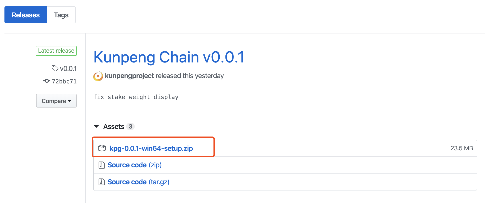
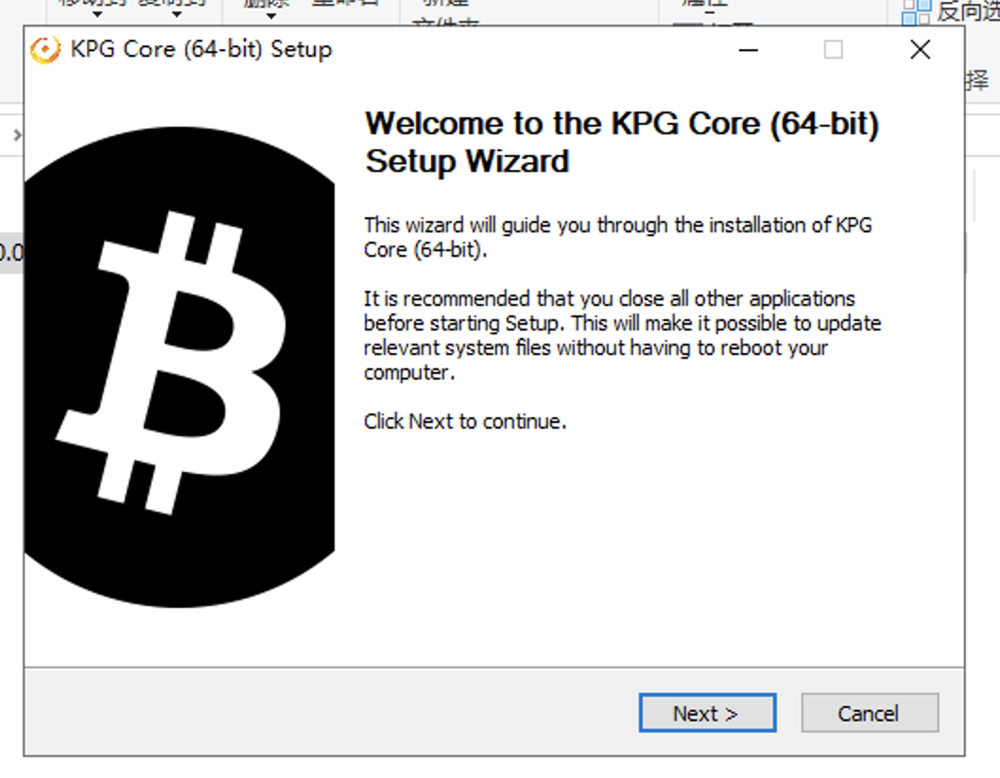
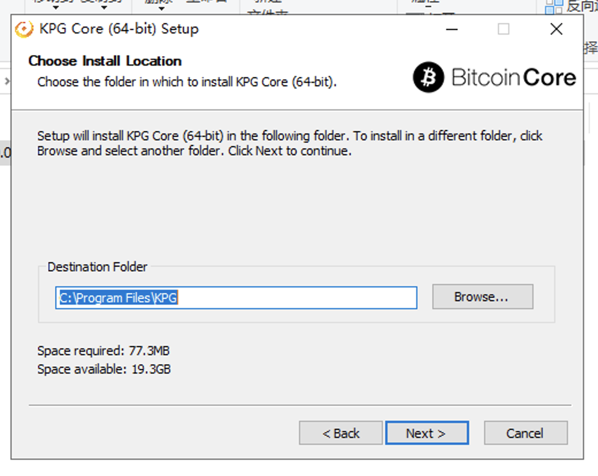
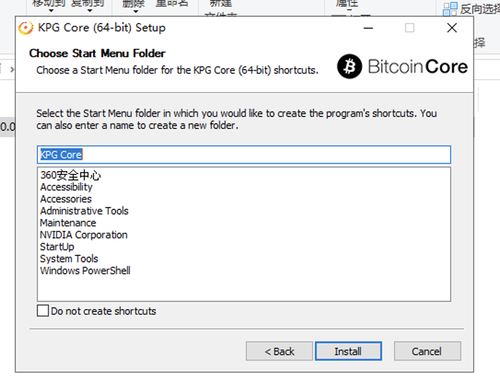
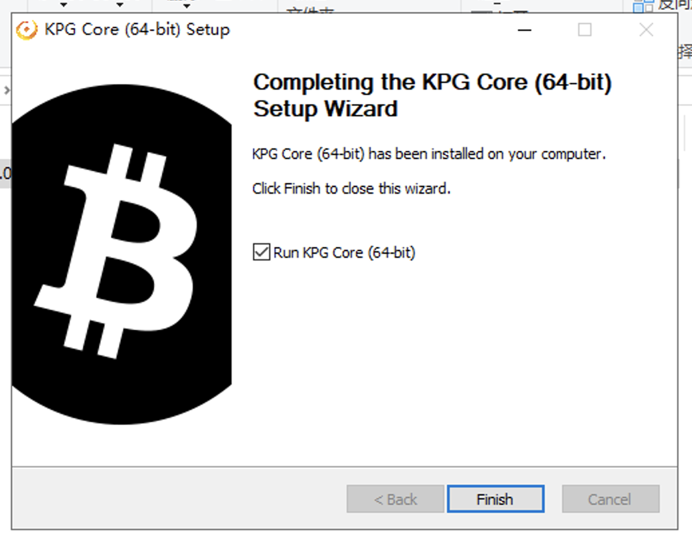
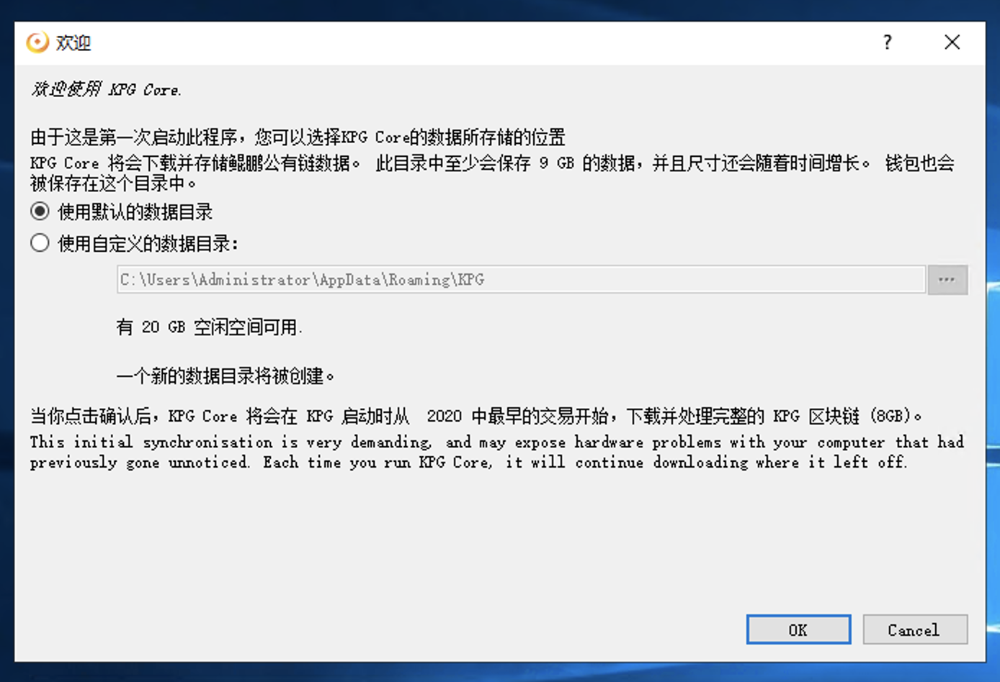
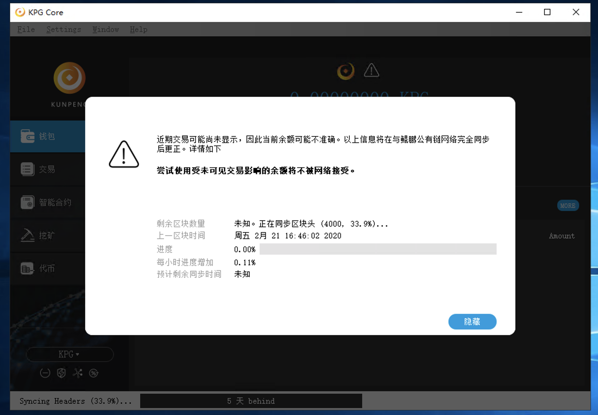
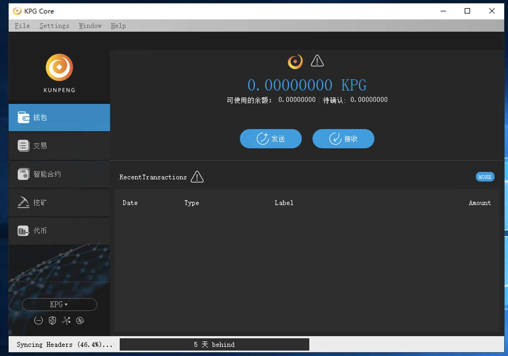
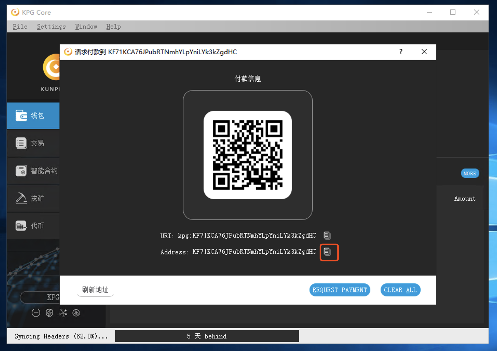
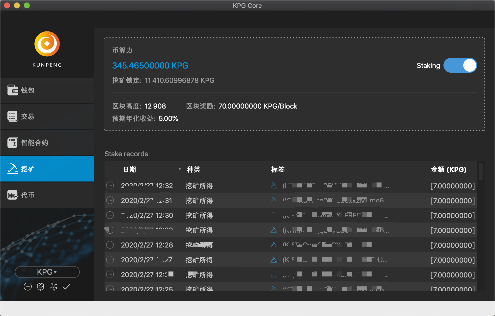

# 鲲鹏公有链使用教程

## 1. 下载和安装
* 在浏览器中打开链接 [https://github.com/kunpengproject/kpgchain/releases/latest](https://github.com/kunpengproject/kpgchain/releases/latest)

选择操作系统对应的文件进行下载
* 下载完成后解压文件，双击程序进行安装

* 点击“Finish”，鲲鹏公有链全节点钱包就启动起来了
* 选择默认的数据目录

* 等待区块同步数据同步

## 2. 接收和发送
* 点击页面上的“接收”按钮，在弹出的页面中可以看到收款二维码和收款地址。

* 同理，点击“发送”按钮，就可以向别人转账。

## 3. POS 挖矿
* 鲲鹏公有链采用的是 POS v4共识(权益证明)，POS 共识具有公平、高效等优点，同时在抵抗51%攻击方面比 POW(工作量证明) 更具优势。简单来说，POS 共识是用持币数量当作算力，钱包里拥有的KPG越多，POS挖矿的成功概率越高。
* 鲲鹏公有链底层采用的是和比特币一致的 UTXO 模型，一笔 UTXO 相当于一张支票，钱包里的 UTXO 总和即为持币数量。一笔 UTXO在创建后需要经过2000个区块(约36个小时)的确认才能“成熟”，只有“成熟”了的 UTXO 才具备 POS挖矿资格。当一笔UTXO成功出块之后，会产生一笔连带挖矿奖励的新 UTXO，这个新的UTXO会被网络锁定2000个区块，在此期间内，该UTXO会被锁定而无法使用。
* 鲲鹏公有链的初始区块奖励为70 KPG，每4年减半一次。当POS挖矿成功时，并不会将这70 KPG一次性发给出块地址，而是首先发送10% 即7 KPG，剩下的 90% 将在 2000 个区块后分9笔发送。这样的设定增加了鲲鹏公有链的安全稳定性。
* 参与鲲鹏公有链 POS 挖矿非常简单，只需要往钱包内发送一定数量的 KPG，然后等待2000个区块，只要钱包一直运行着，就会自动进行 POS 挖矿。(注意，如果给钱包设置了密码，需要先解锁才可以挖矿）
  